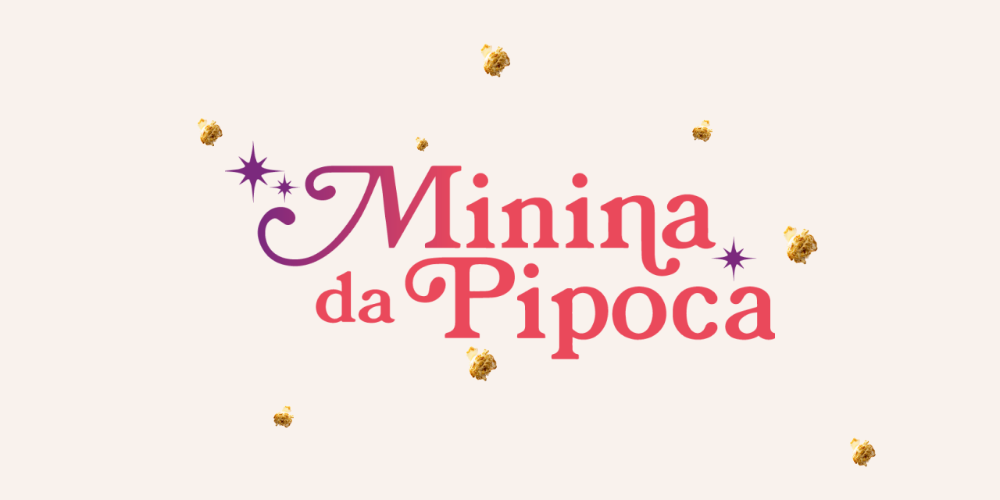

# :popcorn: Minina da Pipoca

  

[Sobre](#hippopotamus-sobre) • [Demonstração](#desktop_computer-demonstração) • [Construido com](#rocket-desenvolvido-com)
 • [Protótipo](#jigsaw-protótipo) • [Como executar](#bulb-como-executar) • [Autores](#star-autores) • [Contribuições](#handshake-contribuições)

### :hippopotamus: Sobre
Lorem ipsum dolor sit amet, consectetur, adipisicing elit. Voluptatibus culpa totam facilis aperiam quasi voluptatem odit nostrum aspernatur doloribus nulla voluptate deleniti nesciunt necessitatibus voluptates corrupti autem facere, adipisci delectus impedit distinctio illo quam? Cum earum nihil odio consectetur unde.

---

### :desktop_computer: Demonstração

Atráves [deste link](https://forge-twenty-six.github.io/minina-da-pipoca) é possível acessar a página de demonstração do projeto no GitHub Pages

---

### :rocket: Desenvolvido com

O Projeto foi desenvolvido utilizando as seguintes tecnologias e ferramentas

- Figma
- VSCode
- HTML
- CSS
- Javascript

---

### :jigsaw: Protótipo

O protótipo da interface foi criado inicialmente utilizando o Figma, é possível acessa-lo através [deste link](https://www.figma.com/design/ivQm3pZ5MblJvihGMnQKxz/Projeto-Final?node-id=517-252).

---

### :bulb: Como executar

Para visualizar o nosso projeto localmente, basta clonar este repositório e abrir o arquivo [index.html](../index.html) em seu navegador.

---

### :star: Autores

<table>
  <tr>
    <td align="center">
      <a href="https://github.com/JoaoVictork" title="defina o titulo do link">
         
        
          <b>João Victor</b>
        
      </a>
    </td>
    <td align="center">
      <a href="https://github.com/mariaburkhardt" title="defina o titulo do link">
         
        
          <b>Maria Burkhardt</b>
        
      </a>
    </td>
    <td align="center">
      <a href="https://github.com/paodelonga" title="defina o titulo do link">
         
        
          <b>Paodelonga</b>
        
      </a>
    </td>
    <td align="center">
      <a href="https://github.com/Poxa-Marreco" title="defina o titulo do link">
         
        
          <b>Pedro Igor</b>
        
      </a>
    </td>
  </tr>
</table>

---

### :handshake: Contribuições

Suas contribuições são bem-vindas! leia a [página de contribuições](./CONTRIBUTING.md) caso deseje contribuir com o projeto.